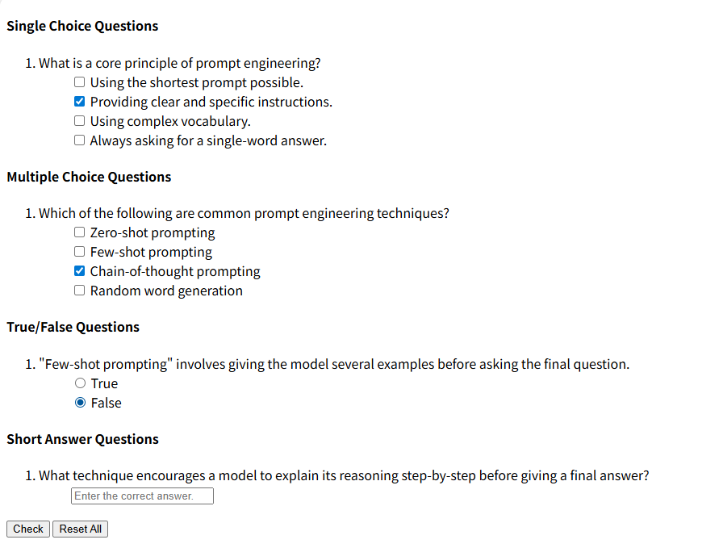
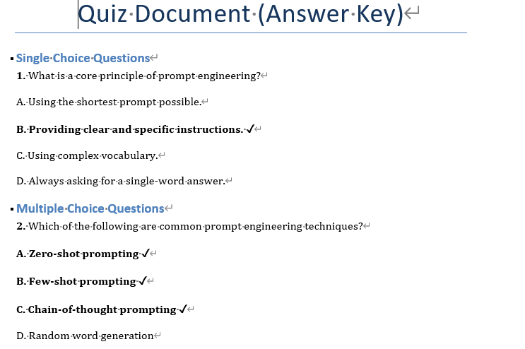

# MCP Quiz Generator

一个基于 Model Context Protocol (MCP) 的测验生成器服务器，可根据要求生成 Markdown 问题，并将其内容转换为 HTML 和 Word 格式的测验文件。

## 功能特性

- 🎯 支持多种题型：单选题、多选题、判断题、简答题
- 📄 生成 HTML 交互式测验文件
- 📝 生成 Word 格式测验文件（包含答案版和学生版）
- 🔧 基于 MCP 协议，可与 Cursor、VSCode 等编辑器集成
- ⚡ 使用 uv 进行快速依赖管理

## 支持的题型格式

### 单选题
```markdown
1. MaxSoft 开发了哪些测试自动化框架？
    - [x] IntelliAPI  (正确答案用 [x] 标记)
    - [ ] WebBot      (错误答案用 [ ] 标记)
    - [ ] Gauge
    - [ ] Selenium
```

### 多选题
```markdown
2. MaxSoft 开发了哪些测试自动化框架？
    - [x] IntelliAPI  (多个正确答案都用 [x] 标记)
    - [x] WebBot      
    - [ ] Gauge       (错误答案用 [ ] 标记)
    - [ ] Selenium
```

### 判断题
```markdown
3. MaxSoft 是一家软件公司。
    - (x) 正确        (正确答案用 (x) 标记)
    - ( ) 错误        (错误答案用 ( ) 标记)
```

### 简答题
```markdown
4. 谁是 MaxSoft 的联合创始人？
    - R:= Osanda      (答案用 R:= 后跟正确答案)
```

## 安装和设置

### 前置要求

- Python 3.10 或更高版本
- [uv](https://docs.astral.sh/uv/) 包管理器

## 在 Cursor/VSCode 中配置 MCP

### 方法一：使用 uv 运行（推荐）

1. **创建 MCP 配置文件**：

   在 Cursor/VSCode 中，打开 MCP 设置并添加以下配置：

   ```json
   {
     "mcpServers": {
       "mcp-quiz-generator": {
         "command": "uv",
         "args": ["run", "mcp-quiz-generator" , "--output-folder" , "{output-folder-path}"]
       }
     }
   }
   ```
   
**注意**：将 `{output-folder-path}` 替换为生成文件的存储路径。

### 方法二：使用 Python 直接运行

1. **首先确保依赖已安装**：
   ```bash
   uv sync
   ```

2. **在 MCP 配置中添加**：
   ```json
   {
     "mcpServers": {
       "mcp-quiz-generator": {
         "command": "/path/to/mcp-quiz-generator/.venv/bin/python",
         "args": ["run", "mcp-quiz-generator" , "--output-folder" , "{output-folder-path}"]
       }
     }
   }
   ```

**注意**：将 `{output-folder-path}` 替换为生成文件的存储路径。

### 工具参数

- `markdown_content`: Markdown 格式的测验内容
- `format_type`: 输出格式
  - `"html"`: 仅生成 HTML 文件
  - `"word"`: 仅生成 Word 文件
  - `"both"`: 生成 HTML 和 Word 文件（默认）
- `custom_filename`: 自定义文件名（可选，不包含扩展名）

## 输出文件

若不使用`--output-folder`参数，则生成的文件将默认保存在 `data/` 目录中：

- **HTML 文件**: 交互式测验，支持在线答题

- 

- **Word 文件**:

   

- 
  
  - `*_quiz.docx`: 学生版（不含答案）
  - `*_answer_key.docx`: 教师版（含答案和标记）

### 项目结构

```
mcp-quiz-generator/
├── src/
│   └── quiz_mcp/
│       ├── __init__.py
│       ├── server.py          # MCP 服务器主文件
│       └── app/               # 应用模块目录
│           ├── extensions/    # Markdown 扩展
│           └── static/        # 静态资源文件
├── data/                      # 输出文件目录（默认）
├── pyproject.toml            # 项目配置
├── uv.lock                   # 依赖锁定文件
└── README.md                 # 项目文档
```

## 故障排除

### 常见问题

1. **uv 命令未找到**
   - 确保 uv 已正确安装并添加到 PATH
   - 重启终端或编辑器

2. **MCP 服务器连接失败**
   - 检查配置文件中的路径是否正确
   - 确保虚拟环境已创建：`uv sync`
   - 查看编辑器的 MCP 日志获取详细错误信息

3. **生成的文件格式不正确**
   - 检查 Markdown 内容是否遵循指定格式
   - 确保选项前有正确的缩进（4个空格）

### --output-folder 参数说明

`--output-folder` 参数用于指定生成的测验文件的输出目录。

**语法**：
```bash
uv run mcp-quiz-generator --output-folder <目录路径>
```

**参数说明**：
- `<目录路径>`: 指定输出文件的目录路径
- 默认值: `data` (如果不指定此参数，文件将保存到 `data/` 目录)
- 如果指定的目录不存在，程序会自动创建

**使用示例**：
```bash
# 使用默认输出目录 (data/)
uv run mcp-quiz-generator

# 指定自定义输出目录
uv run mcp-quiz-generator --output-folder ./my_quizzes

# 指定绝对路径
uv run mcp-quiz-generator --output-folder /home/user/quiz_files

# 指定相对路径
uv run mcp-quiz-generator --output-folder ../output
```

## 使用示例

### 完整对话示例：生成Prompt Engineering测验

以下是一个完整的使用示例，展示如何通过AI助手生成关于Prompt Engineering的测验：

**用户提问**：
```
Q: give me some quiz about Prompt Engineering then generate word and html file
```

**AI助手回复**：
```
Of course, I can generate a quiz about Prompt Engineering for you. Here are a few questions. I will then use a tool to generate the Word and HTML files.

Here is the quiz content:

#### Single Choice Questions

1. What is a core principle of prompt engineering?
   -  Using the shortest prompt possible.
   -  Providing clear and specific instructions.
   -  Using complex vocabulary.
   -  Always asking for a single-word answer.

#### Multiple Choice Questions

1. Which of the following are common prompt engineering techniques?
   -  Zero-shot prompting
   -  Few-shot prompting
   -  Chain-of-thought prompting
   -  Random word generation

#### True/False Questions

1. "Few-shot prompting" involves giving the model several examples before asking the final question.
   - (x) True
   - ( ) False

#### Short Answer Questions

1. What technique encourages a model to explain its reasoning step-by-step before giving a final answer?
   - R:= Chain-of-thought prompting

Now, let me generate the files for you.

(mcp-quiz-generator : generate_quiz已完成)

I have generated the quiz files for you in both Word and HTML formats. Here are the files that have been created:

- **HTML (Interactive Quiz):** `{output-folder-path}\Prompt_Engineering_Quiz.html`
- **Word (Quiz for students):** `{output-folder-path}\Prompt_Engineering_Quiz_quiz.docx`
- **Word (Answer Key):** `{output-folder-path}\Prompt_Engineering_Quiz_answer_key.docx`

Let me know if you need anything else
```

## 许可证

MIT License

## 贡献

欢迎提交 Issue 和 Pull Request！

## 更新日志

### v0.1.0
- 初始版本
- 支持基本的测验生成功能
- 支持 HTML 和 Word 格式输出
- 集成 MCP 协议
